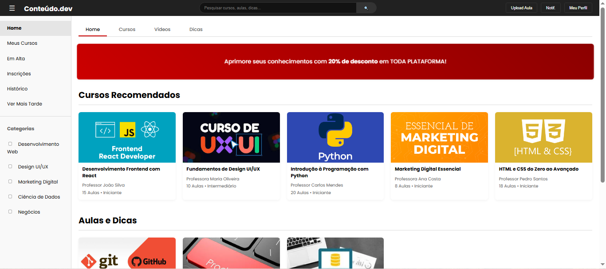
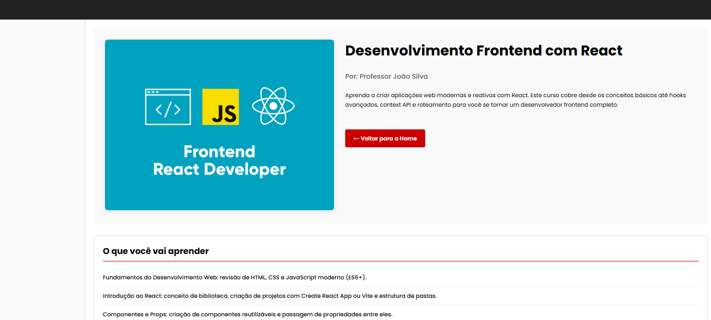

# Trabalho Prático 05 - Semanas 7 e 8

**Páginas de detalhes dinâmicas**

Nessa etapa, vamos evoluir o trabalho anterior, acrescentando a página de detalhes, conforme o  projeto escolhido. Imagine que a página principal (home-page) mostre um visão dos vários itens que existem no seu site. Ao clicar em um item, você é direcionado pra a página de detalhes. A página de detalhe vai mostrar todas as informações sobre o item do seu projeto. seja esse item uma notícia, filme, receita, lugar turístico ou evento.

Leia o enunciado completo no Canvas. 

**IMPORTANTE:** Assim como informado anteriormente, capriche na etapa pois você vai precisar dessa parte para as próximas semanas. 

**IMPORTANTE:** Você deve trabalhar e alterar apenas arquivos dentro da pasta **`public`,** mantendo os arquivos **`index.html`**, **`styles.css`** e **`app.js`** com estes nomes, conforme enunciado. Deixe todos os demais arquivos e pastas desse repositório inalterados. **PRESTE MUITA ATENÇÃO NISSO.**

## Informações Gerais

- Nome: Victor Gabriel Soares Ananias
- Matricula: 903685
- Proposta de projeto escolhida: 5. Temas e Conteúdos Associados" com tema de Tema e vídeos, curso e aulas, categoria e dicas
- Breve descrição sobre seu projeto: Meu projeto é uma platafora de ensino, contendo nela cursos, videos e dícas. Com foco principal em assuntos ligados a tecnologia, desenvolvimento, marketing, etc...

## Print da Home-Page



## Print da página de detalhes do item



## Cole aqui abaixo a estrutura JSON utilizada no app.js

```javascript
const dados = [
    {
        id: 1,
        tipo: 'curso',
        imagem: 'images/frontend.png',
        titulo: 'Desenvolvimento Frontend com React',
        autor: 'Professor João Silva',
        resumo: '15 Aulas • Iniciante',
        descricao: 'Aprenda a criar aplicações web modernas e reativas com React. Este curso cobre desde os conceitos básicos até hooks avançados, context API e roteamento para você se tornar um desenvolvedor frontend completo.',
        outras_infos: ['Fundamentos do Desenvolvimento Web: revisão de HTML, CSS e JavaScript moderno (ES6+).',
'Introdução ao React: conceito de biblioteca, criação de projetos com Create React App ou Vite e estrutura de pastas.',
'Componentes e Props: criação de componentes reutilizáveis e passagem de propriedades entre eles.',
'Estado e Ciclo de Vida: gerenciamento de dados internos do componente com useState e useEffect.',
'Eventos e Manipulação de Dados: tratamento de eventos e atualização de estados de forma reativa.',
'Renderização Condicional e Listas: uso de condicionais e loops para exibir elementos dinamicamente.',
'Estilização de Componentes: uso de CSS Modules, Styled Components e Tailwind CSS.',
'React Hooks: principais hooks (useState, useEffect, useRef, useContext, useMemo, useCallback) e boas práticas.',
'Gerenciamento de Estado Global: uso de Context API, Redux ou Zustand para controle de estados complexos.',
'Roteamento com React Router: navegação entre páginas e parâmetros de rota.',
'Integração com APIs: consumo de dados externos com fetch ou axios e exibição dinâmica na interface.',
'Boas Práticas e Estrutura de Projetos: organização de pastas, componentização e padrões de código.',
'Deploy e Otimização de Aplicações: build de produção, hospedagem em plataformas como Vercel ou Netlify e otimização de performance.'
]
    },
    {
        id: 2,
        tipo: 'curso',
        imagem: 'images/cursouiux.jpeg',
        titulo: 'Fundamentos de Design UI/UX',
        autor: 'Professora Maria Oliveira',
        resumo: '10 Aulas • Intermediário',
        descricao: 'Domine os princípios do design de interface e experiência do usuário. Crie protótipos interativos com Figma e aprenda a realizar testes de usabilidade para criar produtos que as pessoas amam usar.',
        outras_infos: ['Introdução ao Design UI/UX: conceitos fundamentais e importância da experiência do usuário em produtos digitais.',
'Diferença entre UI e UX: compreensão dos papéis da interface (UI) e da experiência do usuário (UX).',
'Princípios de Design e Usabilidade: leis do design, heurísticas de Nielsen e boas práticas de interação.',
'Pesquisa e Entendimento do Usuário: coleta de dados, entrevistas, observação e análise de comportamento.',
'Personas e Jornadas do Usuário: criação de perfis representativos e mapeamento da experiência completa do usuário.',
'Arquitetura da Informação: estruturação de conteúdos e fluxos de navegação eficientes.',
'Wireframes e Protótipos: criação de esboços e simulações interativas de interfaces digitais.',
'Design de Interfaces Visuais: composição, alinhamento, espaçamento, hierarquia e consistência visual.',
'Tipografia, Cores e Ícones: escolha de fontes, paletas de cores e elementos gráficos que reforçam a identidade visual.',
'Design Responsivo e Acessibilidade: adaptação a diferentes dispositivos e inclusão de usuários com limitações.',
'Testes de Usabilidade: validação da interface por meio de testes com usuários reais e coleta de feedback.',
'Ferramentas de Design UI/UX: uso de Figma, Adobe XD, Sketch e outras ferramentas de prototipagem.',
'Boas Práticas e Tendências Atuais: princípios de design centrado no usuário e tendências modernas de UI/UX.'
]
    },
    {
        id: 3,
        tipo: 'curso',
        imagem: 'images/python.png',
        titulo: 'Introdução à Programação com Python',
        autor: 'Professor Carlos Mendes',
        resumo: '20 Aulas • Iniciante',
        descricao: 'Um curso completo para quem nunca programou antes. Aprenda lógica de programação, tipos de dados, laços de repetição e funções com a linguagem de programação mais popular do mundo.',
        outras_infos: ['Fundamentos de Lógica de Programação: compreensão de algoritmos, fluxogramas e estruturas básicas de decisão e repetição.',
'Introdução à Linguagem Python: instalação, sintaxe básica e primeiros programas.',
'Tipos de Dados e Operadores: números, textos, booleanos e operadores aritméticos, relacionais e lógicos.',
'Estruturas de Controle de Fluxo: uso de if, elif, else, for e while para controle de execução.',
'Estruturas de Dados: listas, tuplas, conjuntos e dicionários para organização e manipulação de informações.',
'Funções: criação, parâmetros, retorno de valores e escopo de variáveis.',
'Manipulação de Arquivos: leitura e escrita de arquivos de texto para armazenar dados.',
'Módulos e Bibliotecas: importação e uso de bibliotecas padrão e externas com pip.',
'Introdução à Programação Estruturada: boas práticas, modularização e documentação de código.',
'Resolução de Problemas e Projetos Práticos: desenvolvimento de pequenos programas aplicando todo o conteúdo estudado.'
]
    },
    {
        id: 4,
        tipo: 'curso',
        imagem: 'images/capamarketing.png',
        titulo: 'Marketing Digital Essencial',
        autor: 'Professora Ana Costa',
        resumo: '8 Aulas • Iniciante',
        descricao: 'Descubra os conceitos e estratégias essenciais para começar a divulgar produtos e serviços online, incluindo SEO, mídias sociais e email marketing.',
        outras_infos: ['Introdução ao Marketing Digital: conceitos básicos, importância e principais canais digitais.',
'Funil de Vendas e Jornada do Cliente: etapas de atração, conversão e fidelização de clientes.',
'Estratégias de Branding e Posicionamento: construção de marca e diferenciação no ambiente digital.',
'Marketing de Conteúdo: criação de conteúdo relevante para atrair e engajar o público-alvo.',
'SEO (Otimização para Mecanismos de Busca): técnicas para melhorar o posicionamento de sites no Google.',
'Gestão de Mídias Sociais: planejamento, criação e análise de conteúdo para redes sociais.',
'E-mail Marketing e Automação: estratégias de nutrição de leads e personalização de mensagens.',
'Publicidade Online e Google Ads: campanhas pagas, segmentação e análise de resultados.',
'Marketing de Influência: parcerias com criadores de conteúdo e microinfluenciadores.',
'Métricas e Análise de Desempenho: acompanhamento de KPIs, Google Analytics e relatórios.',
'Planejamento de Campanhas Digitais: definição de objetivos, público-alvo e orçamento.',
'Experiência do Usuário e Conversão: otimização de páginas e estratégias de CRO (Conversion Rate Optimization).',
'Tendências e Inovações em Marketing Digital: uso de IA, automação e novas plataformas de engajamento.'
]
    },
    {
        id: 5,
        tipo: 'curso',
        imagem: 'images/htmlcss.png',
        titulo: 'HTML e CSS do Zero ao Avançado',
        autor: 'Professor Pedro Santos',
        resumo: '18 Aulas • Iniciante',
        descricao: 'Construa a base sólida que todo desenvolvedor web precisa. Este curso aborda desde as tags mais básicas de HTML até técnicas avançadas de layout com Flexbox e Grid em CSS.',
        outras_infos: ['Introdução à Web e Estrutura HTML: fundamentos da web, funcionamento de navegadores e estrutura básica de um documento HTML.',
'Tags e Elementos Essenciais: uso de tags como <html>, <head>, <body>, <p>, <h1> a <h6>, e outras.',
'Textos, Links e Imagens: formatação de texto, inserção de links e imagens com atributos apropriados.',
'Listas, Tabelas e Formulários: criação e estilização de listas ordenadas, tabelas e formulários interativos.',
'Atributos, IDs e Classes: aplicação de identificadores e classes para estilização e manipulação via CSS.',
'Introdução ao CSS: conceito de folhas de estilo e formas de aplicação (inline, interno e externo).',
'Seletores e Propriedades CSS: seleção de elementos e aplicação de propriedades de estilo.',
'Cores, Fontes e Unidades de Medida: uso de RGB, HEX, HSL, tipografia e unidades relativas e absolutas.',
'Box Model e Posicionamento: margens, bordas, padding, tamanhos e posicionamento de elementos.',
'Display, Flexbox e Grid Layout: técnicas modernas para criação de layouts responsivos e dinâmicos.',
'Pseudo-classes e Pseudo-elementos: estilização avançada de estados e partes específicas de elementos.',
'Responsividade e Media Queries: adaptação de layouts para diferentes tamanhos de tela e dispositivos.',
'Boas Práticas e Semântica HTML: uso correto de tags semânticas para acessibilidade e SEO.',
'Animações e Transições CSS: criação de efeitos visuais e interações com propriedades animadas.',
'Publicação e Otimização de Sites: exportação, compressão de arquivos e hospedagem em servidores.'
]
    },
    {
        id: 6,
        tipo: 'aula',
        imagem: 'images/git.png',
        titulo: 'Aula: Introdução ao Git e GitHub',
        autor: 'Professor Rodrigo Alves',
        resumo: '25 min • Dica',
        descricao: 'Uma aula rápida e prática para você entender os comandos essenciais do Git e como colaborar em projetos de forma eficiente usando o GitHub.',
        outras_infos: ['Introdução ao Controle de Versão: importância do versionamento e principais benefícios do uso do Git.',
'Instalação e Configuração do Git: instalação do Git, configuração de nome, e-mail e editor padrão.',
'Conceitos Fundamentais do Git: repositórios, commits, snapshots e áreas de stage e working directory.',
'Comandos Básicos do Git: uso de git init, git add, git commit, git status e git log.',
'Trabalhando com Branches: criação, alternância e exclusão de branches para organizar o desenvolvimento.',
'Merge e Resolução de Conflitos: fusão de branches e resolução de conflitos entre versões.',
'Histórico e Reversão de Alterações: visualização de histórico e uso de git revert e git reset.',
'Introdução ao GitHub: o que é o GitHub e como ele facilita a colaboração em projetos.',
'Repositórios Remotos e Clonagem: criação, clonagem e sincronização de repositórios com git push e git pull.',
'Pull Requests e Colaboração: fluxo de contribuição, revisão e aprovação de código entre desenvolvedores.',
'Forks e Contribuição em Projetos: cópia de repositórios para colaboração e envio de melhorias.',
'Git Ignore e Boas Práticas: uso de arquivos .gitignore e convenções para manter repositórios limpos.',
'Chaves SSH e Autenticação: configuração de autenticação segura entre Git e GitHub.',
'Gerenciamento de Versionamento em Equipe: boas práticas de colaboração, commits padronizados e mensagens descritivas.',
'Fluxos de Trabalho (Git Flow e GitHub Flow): estratégias organizadas para controle de versões e entregas contínuas.'
]
    },
    {
        id: 7,
        tipo: 'dica',
        imagem: 'images/produtividade.jpeg',
        titulo: 'Ferramentas para Produtividade',
        autor: 'Comunidade',
        resumo: '5 min • Dica',
        descricao: 'Descubra 5 ferramentas que podem aumentar drasticamente sua produtividade no dia a dia como desenvolvedor, desde editores de código a gerenciadores de tarefas.',
        outras_infos: ['Introdução à Produtividade Digital: conceitos de eficiência, foco e otimização do trabalho no ambiente digital.',
'Organização e Gestão de Tarefas: uso de ferramentas como Todoist, Notion e Trello para planejar atividades.',
'Mapeamento de Processos e Fluxos de Trabalho: visualização e automação de rotinas com ferramentas como Miro e ClickUp.',
'Comunicação e Colaboração em Equipe: integração e comunicação com Slack, Microsoft Teams e Google Workspace.',
'Ferramentas de Anotações e Documentação: criação e organização de informações com Notion, Evernote e Google Docs.',
'Gestão de Tempo e Priorização: técnicas de produtividade pessoal como Pomodoro, GTD e priorização Eisenhower.',
'Automação de Rotinas e Integrações: uso de Zapier, Make (Integromat) e Power Automate para automatizar tarefas repetitivas.',
'Armazenamento e Compartilhamento em Nuvem: utilização de Google Drive, Dropbox e OneDrive para colaboração segura.',
'Controle de Versões de Arquivos: acompanhamento e histórico de alterações em documentos e projetos.',
'Gestão de Projetos Ágeis: aplicação de metodologias Scrum e Kanban em ferramentas digitais.',
'Monitoramento de Desempenho e Resultados: acompanhamento de métricas com dashboards e relatórios automatizados.',
'Boas Práticas de Produtividade Pessoal: gestão de foco, eliminação de distrações e equilíbrio entre trabalho e descanso.',
'Tendências e Novas Tecnologias de Produtividade: IA generativa, assistentes virtuais e integração de ferramentas inteligentes.'
]
    },
    {
        id: 8,
        tipo: 'aula',
        imagem: 'images/sql.jpg',
        titulo: 'Aula: SQL Básico para Análise de Dados',
        autor: 'Professora Fernanda Lima',
        resumo: '40 min • Aula',
        descricao: 'Aprenda as queries SQL fundamentais para extrair e analisar informações de bancos de dados. Essencial para quem quer trabalhar com dados.',
        outras_infos: ['Introdução ao SQL e Bancos de Dados: fundamentos da linguagem SQL e noções sobre bancos relacionais como MySQL e PostgreSQL.',
'Conceitos de Tabelas, Linhas e Colunas: estrutura e organização dos dados em tabelas relacionais.',
'Comandos SELECT e Filtragem de Dados: extração de informações específicas usando SELECT e WHERE.',
'Operadores Lógicos e de Comparação: uso de AND, OR, NOT, BETWEEN, LIKE e IN para refinar consultas.',
'Ordenação e Limitação de Resultados: aplicação de ORDER BY e LIMIT para organizar saídas de dados.',
'Funções de Agregação e Agrupamento: uso de COUNT, SUM, AVG, MIN e MAX em análises numéricas.',
'Cláusulas GROUP BY e HAVING: agrupamento e filtragem de resultados agregados.',
'Junções (JOINS) entre Tabelas: combinações de dados com INNER JOIN, LEFT JOIN, RIGHT JOIN e FULL JOIN.',
'Subconsultas e Consultas Aninhadas: consultas dentro de outras consultas para análises mais complexas.',
'Criação e Manipulação de Tabelas: comandos CREATE, ALTER e DROP para estruturação de dados.',
'Inserção, Atualização e Exclusão de Dados: uso de INSERT, UPDATE e DELETE em bases de dados.',
'Funções de Texto e Datas: manipulação e formatação de strings e datas nas consultas.',
'Alias, Views e Consultas Otimizadas: criação de apelidos e visões para simplificar consultas e melhorar desempenho.',
'Boas Práticas em Consultas SQL: organização, legibilidade e padronização de código SQL.',
'Introdução à Análise de Dados com SQL: aplicação prática de consultas para gerar insights e relatórios.'
]
    }
];

```